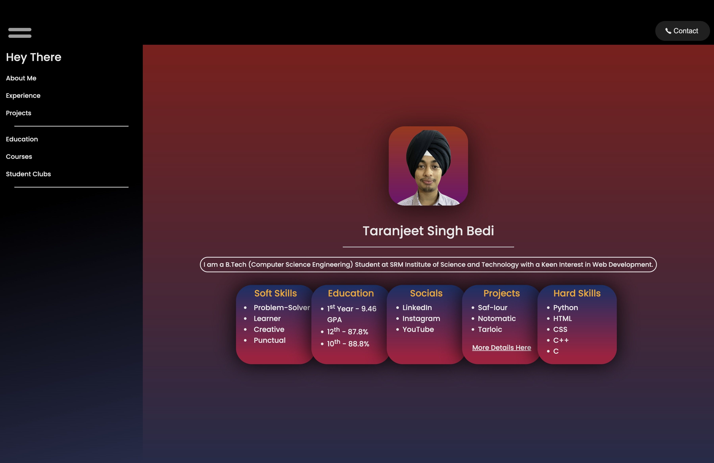
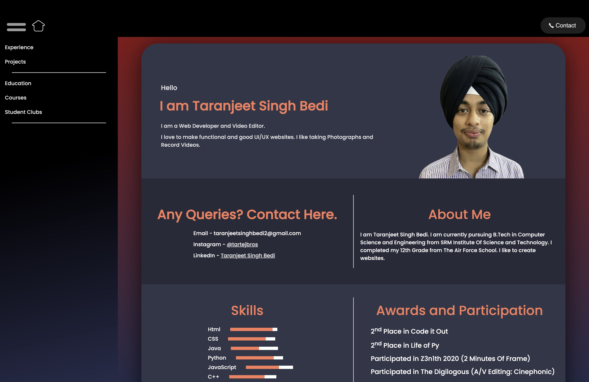
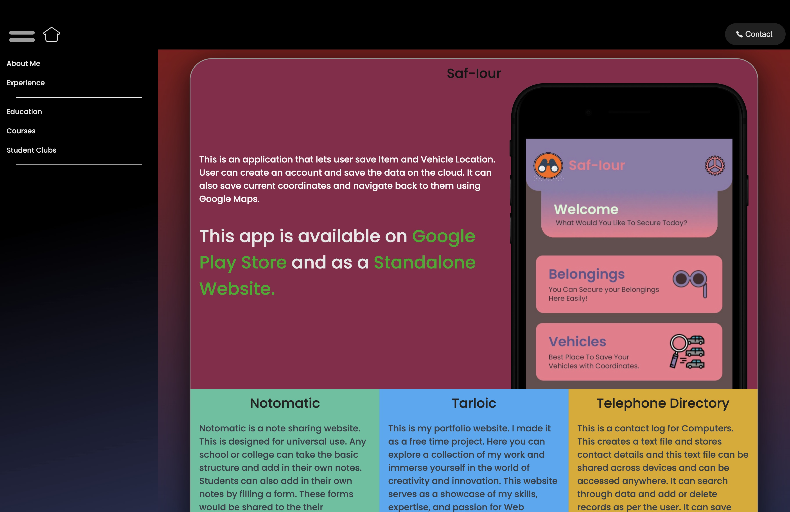
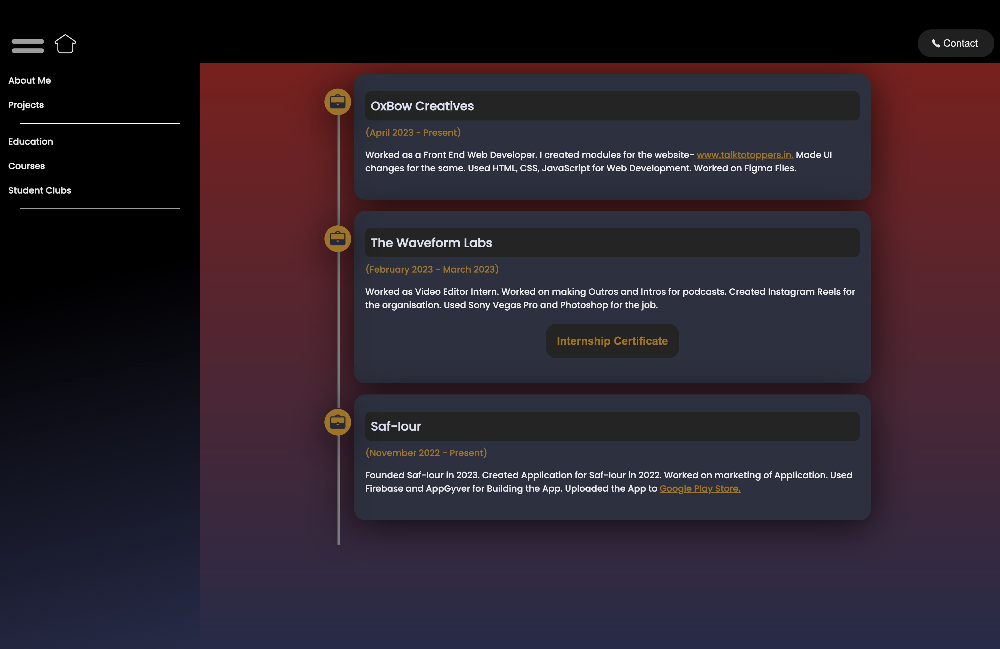
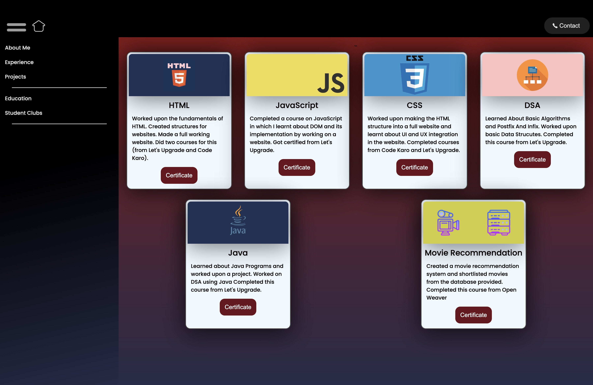

<h1>Tarloic</h1>

This is my Portfolio Site that showcases my achievements and experience in this field.
<h2>Technologies Used</h2>

<ul>
<ul align="center">

 
</ul>
</ul><h2>Features</h2>

<ul>
<li>Clean UI</li>
</ul><ul>
<li>Responsive Mobile View</li>
</ul><ul>
<li>Smooth Transitions</li>
</ul><h2>Screenshots</h2>

<h2>Project Status</h2>

The project is complete but the data will be updated at certain intervals.
<h2>Improvements</h2>

<ul>
<li>Data is not kept up to date</li>
</ul><ul>
<li>UI is casual formal</li>
</ul><h2>Contact</h2>

